# Documentación Técnica del Frontend - InventorIA

## 1. Resumen Ejecutivo

### Propósito del Frontend

**InventorIA** es un sistema frontend desarrollado en React 19 para la gestión integral de inventarios, con capacidades avanzadas de reconocimiento inteligente de facturas mediante procesamiento de imágenes. El frontend actúa como la capa de presentación e interacción del usuario, proporcionando una interfaz moderna, responsiva y accesible para la administración de productos, categorías, facturas internas y reportes.

### Público Objetivo

- **Desarrolladores Frontend**: Necesitan entender la arquitectura, patrones y estructura del código para contribuir o mantener el proyecto.
- **Desarrolladores Full-Stack**: Requieren comprender la integración frontend-backend y los flujos de datos.
- **Arquitectos de Software**: Interesados en las decisiones técnicas y la evolución del sistema.
- **Equipos de QA**: Necesitan entender los flujos de usuario y componentes para diseñar pruebas.

### Alcance Funcional

El frontend cubre las siguientes áreas funcionales:

- **Autenticación y Autorización**: Sistema de login con guardas de ruta y gestión de sesión.
- **Gestión de Inventario**: CRUD completo de productos, categorías y facturas internas.
- **Reconocimiento de Facturas**: Procesamiento de imágenes de facturas para extracción automática de datos.
- **Reportes y Análisis**: Visualización de datos en tablas y gráficos con exportación a PDF/Excel.
- **Gestión de Usuarios y Roles**: Administración del sistema de usuarios y permisos.
- **Dashboard**: Panel de control con métricas y visualizaciones.
- **Calendario**: Gestión de eventos y tareas.
- **Configuración**: Personalización de tema, idioma y preferencias de usuario.

---

## 2. Visión General de la Arquitectura

### Arquitectura Aplicada

El proyecto utiliza una **arquitectura híbrida** que combina:

1. **Feature-Based Organization**: Las páginas están organizadas por funcionalidades (`inventory`, `management`, `dashboard`, etc.).
2. **Component-Based Architecture**: Componentes reutilizables separados por responsabilidad.
3. **Layered Architecture**: Separación clara entre capas de presentación, lógica de negocio y servicios.

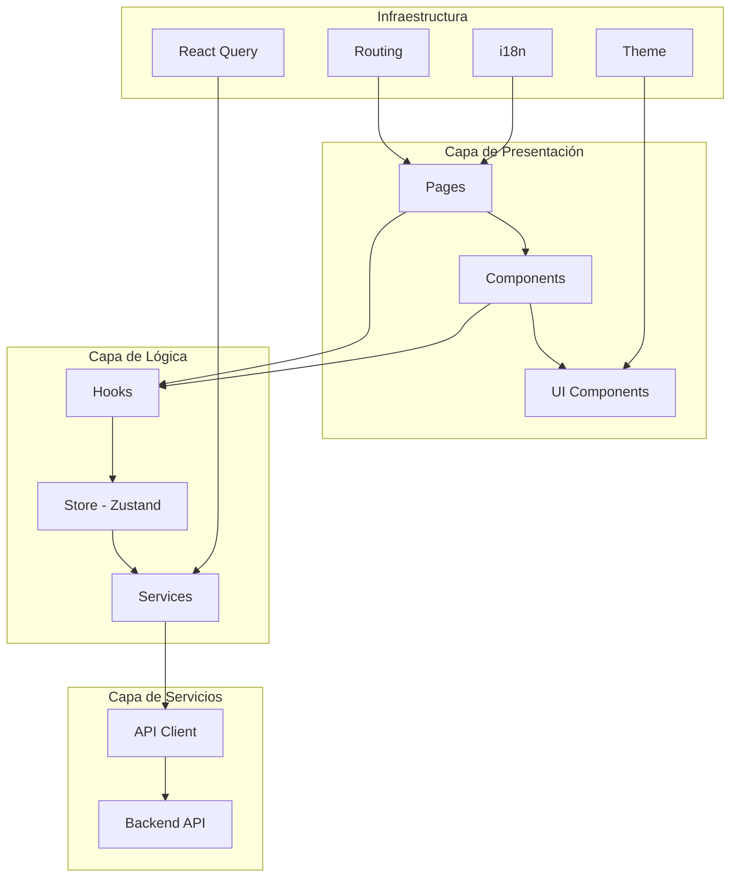

### Diagrama de Módulos y Dependencias

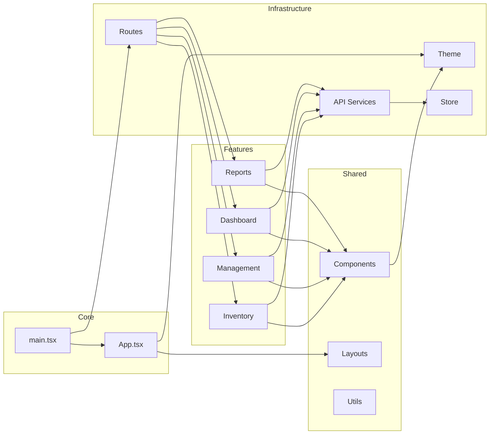

### Justificación Técnica de la Arquitectura

**Decisiones Clave:**

1. **Feature-Based Organization**: Facilita el escalado y mantenimiento. Cada feature es independiente y puede evolucionar sin afectar otras áreas.

2. **Zustand para Estado Global**: Elegido por su simplicidad, rendimiento y menor boilerplate comparado con Redux. Ideal para aplicaciones de tamaño medio.

3. **React Query para Datos Asíncronos**: Maneja automáticamente el caché, sincronización y estados de carga/error, reduciendo código repetitivo.

4. **Separación de UI Components**: Los componentes de `ui/` (shadcn/ui) están separados de los componentes de negocio, permitiendo reutilización y mantenimiento independiente.

5. **Lazy Loading de Rutas**: Implementado mediante `React.lazy()` y `Suspense` para optimizar el bundle inicial y mejorar tiempos de carga.

---

## 3. Estructura del Proyecto

### Árbol de Carpetas Principal

```
inventoria/
├── public/                      # Archivos estáticos públicos
│   └── mockServiceWorker.js    # MSW para mocking en desarrollo
├── src/
│   ├── __tests__/              # Tests unitarios
│   ├── api/                    # Capa de servicios API
│   │   ├── apiClient.ts        # Cliente HTTP configurado (Axios)
│   │   └── services/           # Servicios por entidad
│   │       ├── invoiceService.ts
│   │       ├── productService.ts
│   │       ├── categoryService.ts
│   │       ├── userService.ts
│   │       ├── roleService.ts
│   │       └── menuService.ts
│   ├── assets/                 # Recursos estáticos
│   │   ├── icons/              # Iconos SVG
│   │   └── images/             # Imágenes y logos
│   ├── components/             # Componentes reutilizables
│   │   ├── animate/            # Componentes de animación (Motion)
│   │   ├── auth/               # Componentes de autenticación
│   │   ├── chart/              # Componentes de gráficos
│   │   ├── code/               # Componentes de código
│   │   ├── editor/             # Editor de texto enriquecido
│   │   ├── icon/               # Sistema de iconos
│   │   ├── loading/            # Indicadores de carga
│   │   ├── locale-picker/      # Selector de idioma
│   │   ├── logo/               # Componente de logo
│   │   ├── nav/                # Componentes de navegación
│   │   ├── toast/              # Notificaciones toast
│   │   └── upload/             # Componentes de carga de archivos
│   ├── hooks/                  # Custom hooks
│   │   ├── use-copy-to-clipboard.ts
│   │   └── use-media-query.ts
│   ├── layouts/                # Layouts de la aplicación
│   │   ├── dashboard/          # Layout principal del dashboard
│   │   │   ├── header.tsx
│   │   │   ├── main.tsx
│   │   │   ├── multi-tabs/    # Sistema de pestañas múltiples
│   │   │   └── nav/            # Navegación del dashboard
│   │   └── simple/             # Layout simple (páginas de error)
│   ├── locales/                # Internacionalización
│   │   ├── i18n.ts            # Configuración de i18next
│   │   ├── use-locale.ts      # Hook para traducciones
│   │   └── lang/              # Archivos de traducción
│   │       ├── es_ES.json
│   │       ├── en_US.json
│   │       └── ...
│   ├── pages/                  # Páginas de la aplicación
│   │   ├── components/        # Componentes específicos de páginas
│   │   ├── dashboard/         # Páginas del dashboard
│   │   ├── functions/         # Páginas de funciones
│   │   ├── inventory/         # Páginas de inventario
│   │   ├── management/        # Páginas de gestión
│   │   └── sys/               # Páginas del sistema
│   │       ├── login/        # Página de login
│   │       ├── error/         # Páginas de error
│   │       └── others/        # Otras páginas (calendario, reportes)
│   ├── routes/                 # Configuración de rutas
│   │   ├── components/        # Componentes de rutas (guards)
│   │   ├── hooks/             # Hooks relacionados con rutas
│   │   └── sections/          # Definición de secciones de rutas
│   │       ├── auth.tsx
│   │       ├── dashboard/
│   │       └── main.tsx
│   ├── store/                  # Estado global (Zustand)
│   │   ├── userStore.ts       # Estado del usuario
│   │   ├── settingStore.ts    # Configuraciones de la app
│   │   └── invoiceStore.ts    # Estado de facturas
│   ├── theme/                  # Sistema de temas
│   │   ├── adapter/           # Adaptadores para librerías UI
│   │   ├── hooks/             # Hooks de tema
│   │   ├── tokens/            # Tokens de diseño
│   │   ├── theme-provider.tsx # Provider de tema
│   │   └── theme.css.ts       # Estilos del tema
│   ├── types/                  # Tipos TypeScript
│   │   ├── api.ts             # Tipos de respuestas API
│   │   ├── entity.ts          # Entidades del dominio
│   │   ├── enum.ts            # Enumeraciones
│   │   └── router.ts         # Tipos de rutas
│   ├── ui/                     # Componentes UI base (shadcn/ui)
│   │   ├── button.tsx
│   │   ├── card.tsx
│   │   ├── input.tsx
│   │   └── ... (30+ componentes)
│   ├── utils/                  # Utilidades
│   │   ├── crypto-utils.ts    # Utilidades de encriptación
│   │   ├── export-utils.ts    # Utilidades de exportación
│   │   ├── format-number.ts   # Formateo de números
│   │   ├── highlight.ts       # Resaltado de texto
│   │   ├── storage.ts         # Utilidades de localStorage
│   │   ├── theme.ts           # Utilidades de tema
│   │   └── tree.ts            # Utilidades de árboles
│   ├── App.tsx                 # Componente raíz de la app
│   ├── main.tsx               # Punto de entrada
│   └── global.css             # Estilos globales
├── docs/                       # Documentación
├── package.json                # Dependencias y scripts
├── pnpm-lock.yaml              # Lock file de pnpm
├── tailwind.config.ts          # Configuración de Tailwind
├── tsconfig.json               # Configuración de TypeScript
├── vite.config.ts             # Configuración de Vite
└── vercel.json                 # Configuración de Vercel
```

### Explicación Funcional de Cada Directorio

#### `/src/api`
Contiene toda la lógica de comunicación con el backend. El `apiClient.ts` centraliza la configuración de Axios (baseURL, interceptores, manejo de errores). Los servicios en `services/` encapsulan las llamadas API por entidad.

#### `/src/components`
Componentes reutilizables compartidos entre múltiples páginas. Incluye componentes de UI, animaciones, autenticación, gráficos, etc. Siguen el principio de composición.

#### `/src/pages`
Páginas completas de la aplicación, organizadas por feature. Cada página puede tener sus propios componentes en `pages/components/` si son específicos de esa página.

#### `/src/layouts`
Estructuras de layout que envuelven las páginas. El `dashboard` layout incluye header, navegación y área de contenido principal.

#### `/src/routes`
Configuración de React Router. Las rutas están organizadas por secciones (auth, dashboard, main) y utilizan lazy loading para optimización.

#### `/src/store`
Estado global gestionado con Zustand. Cada store maneja un dominio específico (usuario, configuraciones, facturas).

#### `/src/theme`
Sistema de temas completo con soporte para modo claro/oscuro, paletas de colores, tipografía y adaptadores para librerías UI externas (Ant Design).

#### `/src/ui`
Componentes base de shadcn/ui. Son componentes primitivos, accesibles y altamente personalizables que sirven como base para los componentes de negocio.

#### `/src/utils`
Funciones auxiliares puras sin dependencias de React. Incluyen formateo, encriptación, exportación, etc.

---

## 4. Librerías y Dependencias Utilizadas

### Dependencias Principales

#### **React 19.1.0** y **React DOM 19.1.0**
- **Por qué se eligió**: Versión más reciente de React con mejoras en rendimiento, Server Components y nuevas APIs.
- **Cómo se integra**: Base del framework. Se utiliza con JSX y hooks modernos.
- **Ejemplo de uso**:
```tsx
import { useState, useEffect } from "react";

function ProductList() {
  const [products, setProducts] = useState<ProductInfo[]>([]);
  
  useEffect(() => {
    // Cargar productos
  }, []);
  
  return <div>{/* UI */}</div>;
}
```

#### **React Router 7.0.2**
- **Por qué se eligió**: Librería estándar para routing en React, con soporte para lazy loading y data loading.
- **Cómo se integra**: Configuración centralizada en `src/routes/sections/` con `createBrowserRouter`.
- **Ejemplo de uso**:
```tsx
// src/routes/sections/dashboard/frontend.tsx
export const frontendDashboardRoutes: RouteObject[] = [
  { path: "product", element: Component("/pages/inventory/product") },
  { path: "invoice/:id", element: Component("/pages/inventory/invoice/detail") },
];
```

#### **Zustand 4.5.5**
- **Por qué se eligió**: Solución ligera y simple para estado global, sin boilerplate de Redux. Soporta middleware de persistencia.
- **Cómo se integra**: Stores en `src/store/` con persistencia en localStorage.
- **Ejemplo de uso**:
```tsx
// src/store/userStore.ts
const useUserStore = create<UserStore>()(
  persist(
    (set) => ({
      userInfo: {},
      actions: {
        setUserInfo: (userInfo) => set({ userInfo }),
        clearUserInfoAndToken: () => set({ userInfo: {} }),
      },
    }),
    { name: "userStore", storage: createJSONStorage(() => localStorage) }
  )
);

// Uso en componente
const userInfo = useUserInfo();
const { setUserInfo } = useUserActions();
```

#### **@tanstack/react-query 5.60.2**
- **Por qué se eligió**: Gestión automática de caché, sincronización, estados de carga/error y refetching inteligente.
- **Cómo se integra**: Provider en `App.tsx`, hooks `useQuery` y `useMutation` en componentes.
- **Ejemplo de uso**:
```tsx
// src/store/userStore.ts
export const useSignIn = () => {
  const { setUserInfo } = useUserActions();
  
  const signInMutation = useMutation({
    mutationFn: userService.signin,
  });
  
  const signIn = async (data: SignInReq) => {
    const res = await signInMutation.mutateAsync(data);
    if (res?.success) {
      setUserInfo(res.user);
    }
    return res.user;
  };
  
  return signIn;
};
```

#### **Axios 1.7.7**
- **Por qué se eligió**: Cliente HTTP robusto con interceptores, mejor manejo de errores que fetch nativo.
- **Cómo se integra**: Instancia configurada en `src/api/apiClient.ts` con interceptores para errores y autenticación.
- **Ejemplo de uso**:
```tsx
// src/api/apiClient.ts
const axiosInstance = axios.create({
  baseURL: import.meta.env.VITE_APP_BASE_API,
  headers: { "Content-Type": "application/json;charset=utf-8" },
  withCredentials: true,
});

// Interceptor de respuesta
axiosInstance.interceptors.response.use(
  (res) => res,
  (error: AxiosError) => {
    if (error.response?.status === 401) {
      userStore.getState().actions.clearUserInfoAndToken();
    }
    return Promise.reject(error);
  }
);
```

#### **Tailwind CSS 4.1.3**
- **Por qué se eligió**: Framework utility-first que permite desarrollo rápido y consistente. Integrado con Vite.
- **Cómo se integra**: Configuración en `tailwind.config.ts`, importado en `global.css`.
- **Ejemplo de uso**:
```tsx
<div className="flex flex-col gap-4 md:flex-row md:items-center md:justify-between">
  <h1 className="text-2xl font-semibold">Título</h1>
</div>
```

#### **shadcn/ui** (Componentes Radix UI)
- **Por qué se eligió**: Componentes accesibles, personalizables y basados en Radix UI. No es una dependencia, se copian los componentes al proyecto.
- **Cómo se integra**: Componentes en `src/ui/` copiados y adaptados al tema del proyecto.
- **Ejemplo de uso**:
```tsx
import { Button } from "@/ui/button";
import { Card, CardHeader, CardContent } from "@/ui/card";

<Card>
  <CardHeader>
    <h2>Título</h2>
  </CardHeader>
  <CardContent>
    <Button variant="default">Acción</Button>
  </CardContent>
</Card>
```

#### **Ant Design 5.22.1**
- **Por qué se eligió**: Librería UI completa con componentes avanzados (Tablas, Formularios, Calendarios) que complementan shadcn/ui.
- **Cómo se integra**: Adaptador de tema en `src/theme/adapter/antd.adapter.tsx` para integrar con el sistema de temas.
- **Ejemplo de uso**:
```tsx
import type { ColumnsType } from "antd/es/table";
import { Table } from "antd";

const columns: ColumnsType<InvoiceInfo> = [
  { title: "Código", dataIndex: "codigo_interno", key: "codigo_interno" },
  { title: "Total", dataIndex: "total", key: "total" },
];

<Table columns={columns} dataSource={invoices} pagination={pagination} />
```

#### **React Hook Form 7.56.1** + **Zod 3.24.3**
- **Por qué se eligió**: React Hook Form para formularios performantes con validación mínima de re-renders. Zod para validación type-safe.
- **Cómo se integra**: `@hookform/resolvers/zod` para integrar Zod con React Hook Form.
- **Ejemplo de uso**:
```tsx
import { useForm } from "react-hook-form";
import { zodResolver } from "@hookform/resolvers/zod";
import { z } from "zod";

const schema = z.object({
  nombre: z.string().min(1, "Nombre requerido"),
  precio: z.number().positive("Precio debe ser positivo"),
});

const { register, handleSubmit, formState: { errors } } = useForm({
  resolver: zodResolver(schema),
});
```

#### **i18next 23.16.5** + **react-i18next 13.5.0**
- **Por qué se eligió**: Estándar de la industria para internacionalización, con detección automática de idioma.
- **Cómo se integra**: Configuración en `src/locales/i18n.ts`, hook `useLocale` para traducciones.
- **Ejemplo de uso**:
```tsx
// src/locales/i18n.ts
i18n.init({
  lng: defaultLng,
  fallbackLng: LocalEnum.es_ES,
  resources: {
    es_ES: { translation: es_ES },
    en_US: { translation: en_US },
  },
});

// En componente
import useLocale from "@/locales/use-locale";

const { t } = useLocale();
<h1>{t("sys.nav.reports.index")}</h1>
```

#### **Motion 12.9.0** (Framer Motion)
- **Por qué se eligió**: Librería de animaciones declarativas y performantes para React.
- **Cómo se integra**: Componentes wrapper en `src/components/animate/` con lazy loading.
- **Ejemplo de uso**:
```tsx
import { MotionViewport } from "@/components/animate";

<MotionViewport>
  <div>Contenido animado</div>
</MotionViewport>
```

#### **ApexCharts 4.5.0** + **react-apexcharts 1.5.0**
- **Por qué se eligió**: Librería de gráficos potente y flexible para visualización de datos.
- **Cómo se integra**: Componente wrapper en `src/components/chart/`.
- **Ejemplo de uso**:
```tsx
import { Chart } from "@/components/chart";

<Chart
  type="pie"
  series={[30, 40, 30]}
  categories={["A", "B", "C"]}
/>
```

#### **Day.js 1.11.13**
- **Por qué se eligió**: Alternativa ligera a Moment.js para manipulación de fechas.
- **Cómo se integra**: Importado directamente donde se necesita.
- **Ejemplo de uso**:
```tsx
import dayjs from "dayjs";

const formatted = dayjs(date).format("DD/MM/YYYY");
const isAfter = dayjs(date1).isAfter(date2);
```

#### **Sonner 1.7.0**
- **Por qué se eligió**: Librería de toasts moderna y accesible.
- **Cómo se integra**: Provider en `App.tsx`, uso con `toast.success/error/info`.
- **Ejemplo de uso**:
```tsx
import { toast } from "sonner";

toast.success("Operación exitosa", { position: "top-center" });
toast.error("Error al guardar");
```

#### **jsPDF 3.0.3** + **jspdf-autotable 5.0.2**
- **Por qué se eligió**: Generación de PDFs en el cliente para reportes.
- **Cómo se integra**: Utilidades en `src/utils/export-utils.ts`.
- **Ejemplo de uso**:
```tsx
import { exportToPDF } from "@/utils/export-utils";

exportToPDF({
  title: "Reporte de Productos",
  fileName: "productos",
  columns: [{ title: "Nombre", dataIndex: "nombre" }],
  data: products,
});
```

#### **xlsx 0.18.5**
- **Por qué se eligió**: Generación y lectura de archivos Excel.
- **Cómo se integra**: Utilidades en `src/utils/export-utils.ts`.
- **Ejemplo de uso**:
```tsx
import { exportToExcel } from "@/utils/export-utils";

exportToExcel({
  sheetName: "Productos",
  fileName: "productos",
  data: products,
  columns: [{ title: "Nombre", dataIndex: "nombre" }],
});
```

---

## 5. Principales Funcionalidades y Flujos de la Aplicación

### Descripción de Flujos UI Relevantes

#### Flujo de Autenticación

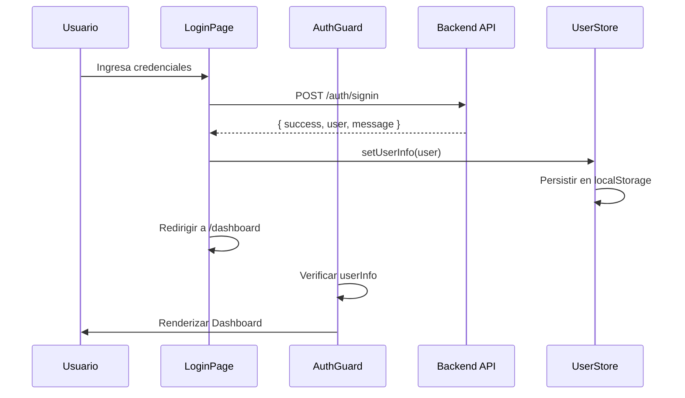

**Implementación**:
```tsx
// src/pages/sys/login/login-form.tsx
const { mutate: signIn, isPending } = useSignIn();

const onSubmit = async (data: SignInFormData) => {
  try {
    await signIn(data);
    navigate("/dashboard", { replace: true });
  } catch (error) {
    // Error manejado por el hook
  }
};
```

#### Flujo de Gestión de Productos

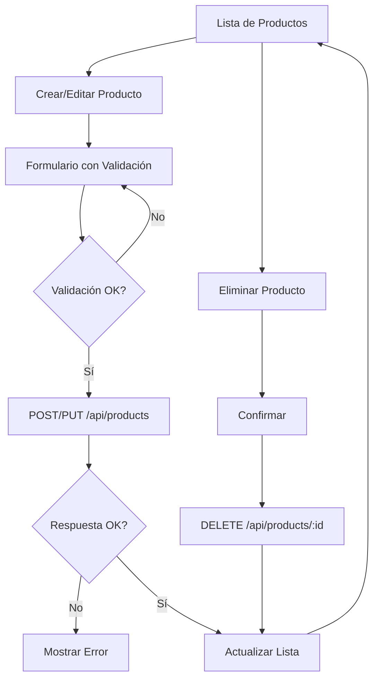

**Implementación**:
```tsx
// src/pages/inventory/product/index.tsx
const { data, isLoading, refetch } = useQuery({
  queryKey: ["products"],
  queryFn: () => productService.getProducts({ page: 1, limit: 10 }),
});

const createMutation = useMutation({
  mutationFn: productService.createProduct,
  onSuccess: () => {
    toast.success("Producto creado");
    refetch();
  },
});
```

#### Flujo de Procesamiento de Facturas con IA

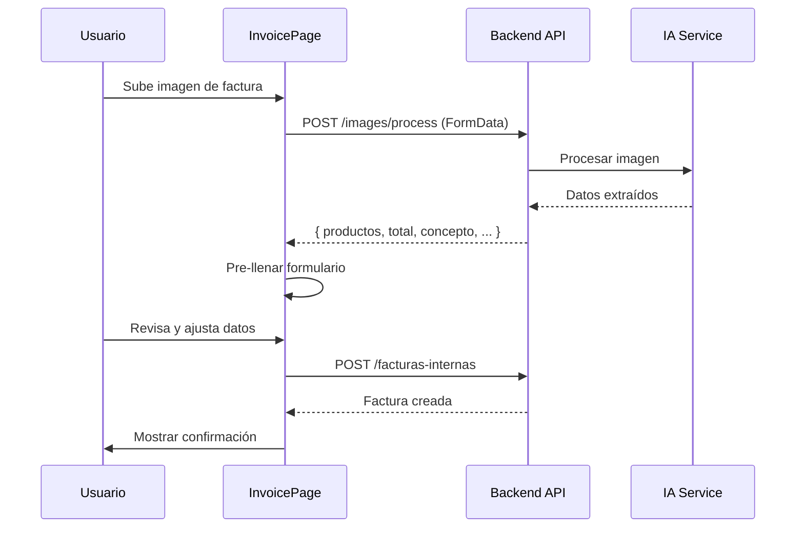

**Implementación**:
```tsx
// src/pages/inventory/invoice/index.tsx
const processImage = async (file: File) => {
  const res = await invoiceService.processInvoiceImage(file);
  if (res.success && res.data) {
    // Pre-llenar formulario con datos extraídos
    setFormData({
      codigo_interno: res.data.codigo_interno,
      concepto: res.data.concepto,
      productos: res.data.productos,
      total: res.data.total,
    });
  }
};
```

### Diagrama de Navegación entre Pantallas

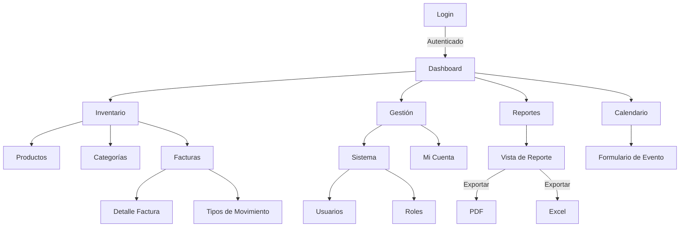

### Flujo de Datos: Backend → Componentes

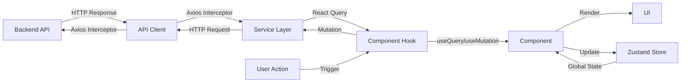

**Ejemplo Completo**:
```tsx
// 1. Service (src/api/services/productService.ts)
const getProducts = (params?: QueryParams) => {
  return apiClient.get<PaginatedProductsRes>({
    url: ProductApi.Products,
    params: queryParams,
  });
};

// 2. Component Hook
const { data, isLoading } = useQuery({
  queryKey: ["products", params],
  queryFn: () => productService.getProducts(params),
});

// 3. Component
function ProductList() {
  const { data, isLoading } = useProductsQuery();
  
  if (isLoading) return <Loading />;
  
  return (
    <Table
      columns={columns}
      dataSource={data?.data.products}
      pagination={data?.data.total}
    />
  );
}
```

### Comportamientos Clave

#### Autenticación
- **Guarda de Rutas**: `LoginAuthGuard` verifica `userInfo` en el store antes de renderizar rutas protegidas.
- **Persistencia**: El token y datos de usuario se guardan en localStorage mediante Zustand persist.
- **Logout Automático**: Interceptor de Axios detecta 401 y limpia la sesión.

#### Formularios
- **Validación**: React Hook Form + Zod para validación type-safe.
- **Estados**: Loading, error y success manejados por React Query mutations.
- **Feedback**: Toasts de Sonner para notificaciones.

#### Filtros y Búsqueda
- **Estado Local**: `useState` para filtros simples.
- **Debounce**: Implementado en búsquedas para optimizar requests.
- **URL Params**: Filtros complejos pueden sincronizarse con query params.

#### Dashboards
- **Métricas**: Cards con datos de resumen.
- **Gráficos**: ApexCharts para visualizaciones interactivas.
- **Actualización**: React Query con refetch automático cada X minutos.

### Ejemplos de Componentes Críticos

#### Componente de Reportes
```tsx
// src/pages/sys/others/reports/index.tsx
export default function ReportsPage() {
  const [reportType, setReportType] = useState<ReportType>("invoices");
  const [viewType, setViewType] = useState<ViewType>("table");
  const [filters, setFilters] = useState<FilterState>({});
  
  // Cargar datos según tipo de reporte
  const { data, isLoading } = useQuery({
    queryKey: ["reports", reportType, filters],
    queryFn: () => fetchReportData(reportType, filters),
  });
  
  // Filtrar datos localmente
  const filteredData = useMemo(() => {
    return applyFilters(data, filters);
  }, [data, filters]);
  
  // Preparar datos para gráficos
  const chartData = useMemo(() => {
    return prepareChartData(filteredData, reportType);
  }, [filteredData, reportType]);
  
  return (
    <div>
      <ReportFilters onFilterChange={setFilters} />
      <ReportView
        viewType={viewType}
        tableData={filteredData}
        chartData={chartData}
      />
      <ExportButtons data={filteredData} />
    </div>
  );
}
```

#### Componente de Factura con Procesamiento de Imagen
```tsx
// src/pages/inventory/invoice/index.tsx
export default function InvoicePage() {
  const [imageFile, setImageFile] = useState<File | null>(null);
  const [processedData, setProcessedData] = useState<InvoiceImageProcessData | null>(null);
  
  const processMutation = useMutation({
    mutationFn: invoiceService.processInvoiceImage,
    onSuccess: (res) => {
      if (res.success && res.data) {
        setProcessedData(res.data);
        toast.success("Factura procesada correctamente");
      }
    },
  });
  
  const handleImageUpload = async (file: File) => {
    setImageFile(file);
    processMutation.mutate(file);
  };
  
  return (
    <div>
      <Upload
        accept="image/*"
        onFileSelect={handleImageUpload}
        loading={processMutation.isPending}
      />
      {processedData && (
        <InvoiceForm
          initialData={processedData}
          onSave={handleSave}
        />
      )}
    </div>
  );
}
```

---

## 6. Arquitectura de Componentes

### Componentes Globales vs. Específicos por Feature

**Componentes Globales** (`src/components/`):
- Reutilizables en múltiples features
- Ejemplos: `Loading`, `Toast`, `Chart`, `Icon`, `Nav`

**Componentes Específicos** (`src/pages/components/`):
- Usados solo en una página o feature específica
- Ejemplos: `ReportFilters`, `ExportButtons`, `InvoiceModal`

### Jerarquía de Componentes

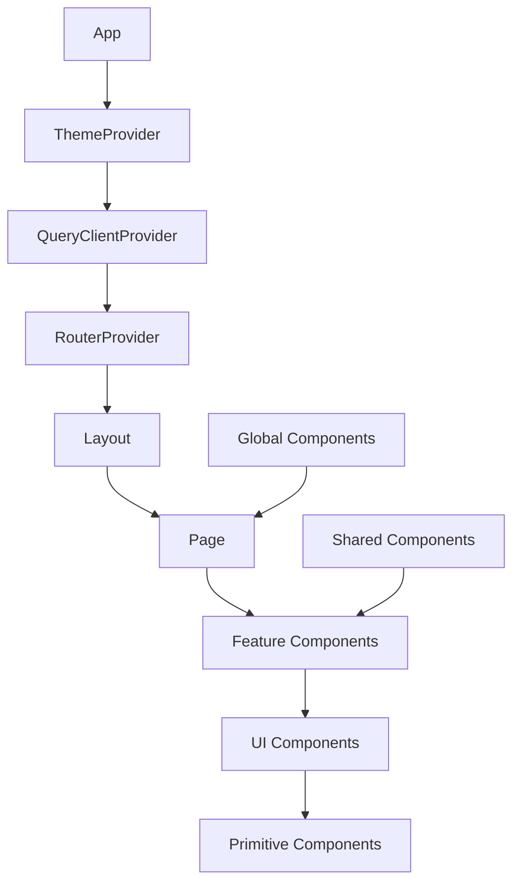

**Ejemplo de Jerarquía Real**:
```tsx
// App.tsx
<ThemeProvider>
  <QueryClientProvider>
    <RouterProvider router={router} />
  </QueryClientProvider>
</ThemeProvider>

// Dashboard Layout
<DashboardLayout>
  <Header />
  <Nav />
  <Main>
    <Outlet /> {/* Páginas */}
  </Main>
</DashboardLayout>

// Página de Productos
<ProductPage>
  <ProductFilters />
  <ProductTable>
    <Table columns={columns} dataSource={products} />
  </ProductTable>
  <ProductModal>
    <Form>
      <Input />
      <Button />
    </Form>
  </ProductModal>
</ProductPage>
```

### Patrón Utilizado

El proyecto utiliza un **patrón híbrido**:

1. **Presentational/Container Pattern** (parcial):
   - Containers: Páginas que manejan lógica y estado
   - Presentational: Componentes UI que solo renderizan

2. **Hooks + UI Pattern**:
   - Lógica extraída a custom hooks
   - Componentes UI puros y reutilizables

3. **Compound Components** (en algunos casos):
   - Ejemplo: `Card`, `CardHeader`, `CardContent` trabajan juntos

**Ejemplo de Separación**:
```tsx
// Container (Página)
// src/pages/inventory/product/index.tsx
export default function ProductPage() {
  const { data, isLoading } = useProductsQuery();
  const createMutation = useCreateProduct();
  
  return (
    <div>
      <ProductFilters />
      <ProductTable
        data={data}
        loading={isLoading}
        onEdit={handleEdit}
        onDelete={handleDelete}
      />
      <ProductModal
        open={isModalOpen}
        onSave={createMutation.mutate}
      />
    </div>
  );
}

// Presentational (Componente UI)
// src/ui/table.tsx (shadcn/ui)
export function Table({ data, columns, loading }) {
  return (
    <div className="table-container">
      {loading ? <Skeleton /> : <TableContent data={data} columns={columns} />}
    </div>
  );
}
```

---

## 7. Gestión de Estado

### Estado Global: Zustand

Zustand se utiliza para estado que necesita ser compartido entre múltiples componentes o persistido.

#### Estructura del Store

```tsx
// Patrón utilizado en todos los stores
type Store = {
  // Estado
  stateField: Type;
  
  // Acciones agrupadas en 'actions'
  actions: {
    actionName: (params) => void;
  };
};

const useStore = create<Store>()(
  persist(
    (set) => ({
      stateField: initialValue,
      actions: {
        actionName: (params) => set({ stateField: newValue }),
      },
    }),
    { name: "storeName", storage: createJSONStorage(() => localStorage) }
  )
);
```

#### Stores Implementados

**1. UserStore** (`src/store/userStore.ts`):
```tsx
type UserStore = {
  userInfo: Partial<UserInfo>;
  actions: {
    setUserInfo: (userInfo: UserInfo) => void;
    clearUserInfoAndToken: () => void;
  };
};

// Hooks de acceso
export const useUserInfo = () => useUserStore((state) => state.userInfo);
export const useUserActions = () => useUserStore((state) => state.actions);
```

**2. SettingStore** (`src/store/settingStore.ts`):
```tsx
type SettingStore = {
  settings: SettingsType; // tema, layout, fuente, etc.
  actions: {
    setSettings: (settings: SettingsType) => void;
    clearSettings: () => void;
  };
};
```

**3. InvoiceStore** (`src/store/invoiceStore.ts`):
```tsx
// Estado específico de facturas (caché local, estado de formularios)
```

### Estado Local: useState, useReducer, Custom Hooks

#### useState
Para estado simple de componentes:
```tsx
const [isOpen, setIsOpen] = useState(false);
const [filters, setFilters] = useState<FilterState>({});
```

#### useReducer
Para estado complejo con múltiples acciones:
```tsx
// Ejemplo hipotético
const [state, dispatch] = useReducer(formReducer, initialState);

dispatch({ type: "SET_FIELD", field: "nombre", value: "Producto 1" });
```

#### Custom Hooks
Para lógica reutilizable:
```tsx
// src/hooks/use-copy-to-clipboard.ts
export function useCopyToClipboard() {
  const [copied, setCopied] = useState(false);
  
  const copy = async (text: string) => {
    await navigator.clipboard.writeText(text);
    setCopied(true);
    setTimeout(() => setCopied(false), 2000);
  };
  
  return { copied, copy };
}
```

### Flujos de Actualización del Estado

#### Flujo 1: Actualización desde API
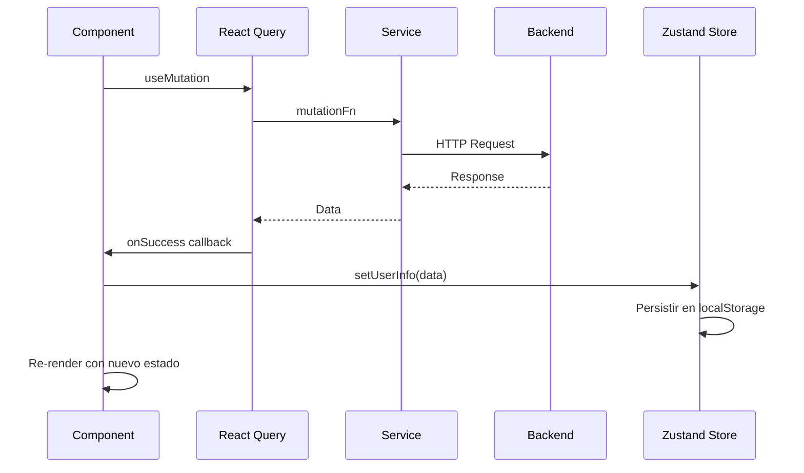

#### Flujo 2: Actualización Local
```tsx
// Componente actualiza estado local
const [count, setCount] = useState(0);
setCount(count + 1); // Re-render inmediato

// Componente actualiza estado global
const { setUserInfo } = useUserActions();
setUserInfo(newUser); // Todos los componentes suscritos se actualizan
```

### Ejemplos de Código

#### Actualización de Estado Global
```tsx
// En un componente
import { useUserActions, useUserInfo } from "@/store/userStore";

function UserProfile() {
  const userInfo = useUserInfo();
  const { setUserInfo } = useUserActions();
  
  const handleUpdate = async (newData: UserInfo) => {
    const res = await userService.updateUser(newData);
    if (res.success) {
      setUserInfo(res.user); // Actualiza store global
      toast.success("Perfil actualizado");
    }
  };
  
  return <div>{userInfo.nombre_usuario}</div>;
}
```

#### Estado con React Query
```tsx
// Hook personalizado
function useProducts() {
  return useQuery({
    queryKey: ["products"],
    queryFn: () => productService.getProducts(),
    staleTime: 5 * 60 * 1000, // 5 minutos
  });
}

// En componente
function ProductList() {
  const { data, isLoading, error, refetch } = useProducts();
  
  // React Query maneja el estado (loading, error, data)
  // No necesitamos useState para estos casos
}
```

---

## 8. Comunicación con el Backend

### Servicios API

Los servicios están organizados por entidad en `src/api/services/`:

```
api/
├── apiClient.ts          # Cliente HTTP configurado
└── services/
    ├── invoiceService.ts
    ├── productService.ts
    ├── categoryService.ts
    ├── userService.ts
    ├── roleService.ts
    └── menuService.ts
```

### Estructura de un Service

```tsx
// src/api/services/invoiceService.ts
import apiClient from "../apiClient";

export enum InvoiceApi {
  Invoices = "/facturas-internas",
  InvoiceDetailsByInvoice = "/detalles-factura/factura",
  ProcessInvoiceImage = "/images/process",
}

export interface QueryParams {
  page: number;
  limit: number;
  estado?: "BORRADOR" | "CONFIRMADA" | "ANULADA";
}

export interface PaginatedInvoicesRes {
  success: boolean;
  message: string;
  data: {
    invoices: InvoiceInfo[];
    total: number;
    page: number;
    totalPages: number;
  };
}

const getInvoices = (params?: QueryParams) => {
  const queryParams = params ? new URLSearchParams() : undefined;
  if (params) {
    queryParams?.append("page", params.page.toString());
    queryParams?.append("limit", params.limit.toString());
    if (params.estado) {
      queryParams?.append("estado", params.estado);
    }
  }

  return apiClient.get<PaginatedInvoicesRes>({
    url: InvoiceApi.Invoices,
    params: queryParams,
  });
};

export default {
  getInvoices,
  getInvoiceDetails,
  updateInvoice,
  processInvoiceImage,
};
```

### Manejo de Errores

#### Interceptores de Axios

```tsx
// src/api/apiClient.ts
axiosInstance.interceptors.response.use(
  (res: AxiosResponse) => res,
  (error: AxiosError) => {
    const { response, message } = error || {};
    const status = response?.status;

    let errMsg = message || t("sys.api.errorMessage");
    
    if (status === 401) {
      // Limpiar sesión si no autorizado
      userStore.getState().actions.clearUserInfoAndToken();
      errMsg = t("sys.api.errMsg401");
    }
    if (status === 400) {
      errMsg = t("sys.api.errMsg400") || "Campos faltantes o formato inválido.";
    }
    if (status === 500) {
      errMsg = t("sys.api.errMsg500") || "Error interno del servidor.";
    }

    toast.error(errMsg, { position: "top-center" });

    return Promise.reject(error);
  }
);
```

#### Manejo en Componentes

```tsx
// Con React Query
const mutation = useMutation({
  mutationFn: productService.createProduct,
  onError: (error) => {
    // Error ya manejado por interceptor, pero podemos agregar lógica adicional
    console.error("Error al crear producto:", error);
  },
  onSuccess: (data) => {
    toast.success("Producto creado");
    queryClient.invalidateQueries({ queryKey: ["products"] });
  },
});
```

### Refresh Tokens

Actualmente no está implementado, pero la estructura permite agregarlo fácilmente en el interceptor de request:

```tsx
// Ejemplo de implementación futura
axiosInstance.interceptors.request.use(async (config) => {
  const token = getToken();
  if (token && isTokenExpired(token)) {
    const newToken = await refreshToken();
    config.headers.Authorization = `Bearer ${newToken}`;
  }
  return config;
});
```

### Ejemplos de Llamadas API Reales

#### GET con Paginación
```tsx
// Service
const getProducts = (params?: QueryParams) => {
  const queryParams = new URLSearchParams();
  queryParams.append("page", params.page.toString());
  queryParams.append("limit", params.limit.toString());
  
  return apiClient.get<PaginatedProductsRes>({
    url: ProductApi.Products,
    params: queryParams,
  });
};

// Uso en componente
const { data } = useQuery({
  queryKey: ["products", page, limit],
  queryFn: () => productService.getProducts({ page, limit }),
});
```

#### POST con FormData
```tsx
// Service
const processInvoiceImage = (image: File) => {
  const formData = new FormData();
  formData.append("image", image);
  
  return apiClient.post<ProcessInvoiceImageRes>({
    url: InvoiceApi.ProcessInvoiceImage,
    data: formData,
    headers: { "Content-Type": "multipart/form-data" },
  });
};

// Uso en componente
const processMutation = useMutation({
  mutationFn: invoiceService.processInvoiceImage,
});

const handleUpload = (file: File) => {
  processMutation.mutate(file);
};
```

#### PUT para Actualización
```tsx
// Service
const updateInvoice = (invoiceId: number, data: UpdateInvoiceData) => {
  const url = `${InvoiceApi.Invoices}/${invoiceId}`;
  return apiClient.put<UpdateInvoiceRes>({ url, data });
};

// Uso en componente
const updateMutation = useMutation({
  mutationFn: ({ id, data }: { id: number; data: UpdateInvoiceData }) =>
    invoiceService.updateInvoice(id, data),
  onSuccess: () => {
    refetch();
  },
});
```

---

## 9. Estilos y Diseño Visual

### Sistema de Diseño Utilizado

El proyecto utiliza un **sistema de diseño híbrido**:

1. **Tailwind CSS**: Framework utility-first para estilos base
2. **shadcn/ui**: Componentes UI con estilos personalizables
3. **Ant Design**: Componentes complejos (Tablas, Formularios)
4. **Vanilla Extract**: CSS-in-JS type-safe para estilos complejos

### Tema Global

#### Configuración del Tema

```tsx
// src/theme/theme-provider.tsx
export function ThemeProvider({ children, adapters = [] }: ThemeProviderProps) {
  const { themeMode, themeColorPresets, fontFamily, fontSize } = useSettings();

  // Actualizar atributos HTML para Tailwind dark mode
  useEffect(() => {
    const root = window.document.documentElement;
    root.setAttribute(HtmlDataAttribute.ThemeMode, themeMode);
    root.setAttribute(HtmlDataAttribute.ColorPalette, themeColorPresets);
    root.style.fontSize = `${fontSize}px`;
    body.style.fontFamily = fontFamily;
  }, [themeMode, themeColorPresets, fontFamily, fontSize]);

  return <>{children}</>;
}
```

#### Tokens de Diseño

```tsx
// src/theme/tokens/
├── colors.ts          # Paletas de colores
├── typography.ts     # Tipografía y fuentes
├── spacing.ts        # Espaciado
├── breakpoints.ts    # Breakpoints responsivos
└── shadows.ts        # Sombras
```

**Ejemplo de Tokens**:
```ts
// src/theme/tokens/colors.ts
export const colorTokens = {
  palette: {
    primary: {
      50: "#fef2f2",
      100: "#fee2e2",
      // ...
      900: "#7f1d1d",
    },
    success: { /* ... */ },
    warning: { /* ... */ },
    error: { /* ... */ },
  },
};
```

### Variables CSS y Breakpoints

#### Tailwind Config

```ts
// tailwind.config.ts
export default {
  darkMode: ["selector", `[data-theme-mode='dark']`],
  theme: {
    extend: {
      colors: {
        primary: creatColorChannel("colors.palette.primary"),
        success: creatColorChannel("colors.palette.success"),
        // ...
      },
      screens: breakpointsTokens, // xs, sm, md, lg, xl, 2xl
    },
  },
};
```

#### Breakpoints

```ts
// src/theme/tokens/breakpoints.ts
export const breakpointsTokens = {
  xs: "0px",
  sm: "640px",
  md: "768px",
  lg: "1024px",
  xl: "1280px",
  "2xl": "1536px",
};
```

### Organización de Estilos

#### 1. Tailwind Utility Classes
```tsx
<div className="flex flex-col gap-4 md:flex-row md:items-center">
  <h1 className="text-2xl font-semibold text-foreground">Título</h1>
</div>
```

#### 2. CSS Modules / Vanilla Extract
```ts
// src/components/chart/styles.css.ts (Vanilla Extract)
import { style } from "@vanilla-extract/css";

export const chartContainer = style({
  width: "100%",
  height: "400px",
  padding: "1rem",
});
```

#### 3. Styled Components (para Ant Design)
```tsx
// Adaptación de temas de Ant Design
import { ConfigProvider } from "antd";

<ConfigProvider theme={antdTheme}>
  <Table />
</ConfigProvider>
```

### Componentes UI Reutilizables Principales

#### shadcn/ui Components (`src/ui/`)
- `Button`: Botones con variantes (default, outline, ghost, etc.)
- `Card`: Contenedor con header, content, footer
- `Input`: Campo de texto con variantes
- `Dialog`: Modal/dialog
- `Table`: Tabla (usando Ant Design en la práctica)
- `Select`: Selector desplegable
- `Toast`: Notificaciones (usando Sonner)
- `Badge`: Etiquetas de estado
- `Calendar`: Calendario
- Y 20+ componentes más

**Ejemplo de Uso**:
```tsx
import { Button } from "@/ui/button";
import { Card, CardHeader, CardContent } from "@/ui/card";
import { Badge } from "@/ui/badge";

<Card>
  <CardHeader>
    <h2>Título</h2>
  </CardHeader>
  <CardContent>
    <Button variant="default">Acción</Button>
    <Badge variant="success">Activo</Badge>
  </CardContent>
</Card>
```

#### Componentes de Negocio (`src/components/`)
- `Chart`: Wrapper de ApexCharts
- `Loading`: Indicadores de carga
- `Nav`: Sistema de navegación
- `Icon`: Sistema de iconos (Iconify)
- `Upload`: Componente de carga de archivos
- `Toast`: Provider de notificaciones

---

## 10. Ruteo

### Configuración de React Router

```tsx
// src/main.tsx
const router = createBrowserRouter(
  [
    {
      Component: () => (
        <App>
          <Outlet />
        </App>
      ),
      errorElement: <ErrorBoundary fallbackRender={PageError} />,
      children: routesSection,
    },
  ],
  {
    basename: VITE_APP_BASE_PATH || "/",
  }
);

ReactDOM.createRoot(document.getElementById("root")!).render(
  <RouterProvider router={router} />
);
```

### Estructura de Rutas

```tsx
// src/routes/sections/index.tsx
export const routesSection: RouteObject[] = [
  ...authRoutes,      // /auth/login
  ...dashboardRoutes, // /dashboard/*
  ...mainRoutes,      // /404, /500, /403
  { path: "*", element: <Navigate to="/404" replace /> },
];
```

### Rutas Públicas

```tsx
// src/routes/sections/auth.tsx
export const authRoutes: RouteObject[] = [
  {
    path: "auth",
    element: (
      <Suspense>
        <Outlet />
      </Suspense>
    ),
    children: [
      { path: "login", element: <LoginPage /> },
    ],
  },
];
```

### Rutas Privadas y Protegidas

```tsx
// src/routes/sections/dashboard/index.tsx
export const dashboardRoutes: RouteObject[] = [
  {
    element: (
      <LoginAuthGuard>  {/* Guarda de autenticación */}
        <Suspense fallback={<LineLoading />}>
          <DashboardLayout />
        </Suspense>
      </LoginAuthGuard>
    ),
    children: [
      { index: true, element: <Navigate to={HOMEPAGE} replace /> },
      ...frontendDashboardRoutes,
    ],
  },
];
```

**Guarda de Autenticación**:
```tsx
// src/routes/components/login-auth-guard.tsx
export default function LoginAuthGuard({ children }: { children: ReactNode }) {
  const userInfo = useUserInfo();
  const location = useLocation();

  if (!userInfo?.id) {
    return <Navigate to="/auth/login" state={{ from: location }} replace />;
  }

  return <>{children}</>;
}
```

### Estructura de Navegación

```tsx
// src/routes/sections/dashboard/frontend.tsx
export const frontendDashboardRoutes: RouteObject[] = [
  { path: "workbench", element: Component("/pages/dashboard/workbench") },
  { path: "analysis", element: Component("/pages/dashboard/analysis") },
  {
    path: "inventory",
    children: [
      { path: "product", element: Component("/pages/inventory/product") },
      { path: "category", element: Component("/pages/inventory/category") },
      { path: "invoice", element: Component("/pages/inventory/invoice") },
      { path: "invoice/:id", element: Component("/pages/inventory/invoice/detail") },
    ],
  },
  {
    path: "management",
    children: [
      {
        path: "system",
        children: [
          { path: "user", element: Component("/pages/management/system/user") },
          { path: "role", element: Component("/pages/management/system/role") },
        ],
      },
    ],
  },
  { path: "reports", element: Component("/pages/sys/others/reports") },
  { path: "calendar", element: Component("/pages/sys/others/calendar") },
];
```

### Lazy Loading de Rutas

```tsx
// src/routes/sections/dashboard/utils.tsx
const Pages = import.meta.glob("/src/pages/**/*.tsx");
const lazyComponentCache = new Map<string, React.LazyExoticComponent<any>>();

export const Component = (path = "", props?: any): React.ReactNode => {
  if (!path) return null;

  let importFn = Pages[`/src${path}.tsx`];
  if (!importFn) importFn = Pages[`/src${path}/index.tsx`];

  let Element = lazyComponentCache.get(path);
  if (!Element) {
    Element = lazy(importFn as any);
    lazyComponentCache.set(path, Element);
  }
  
  return <Element {...props} />;
};
```

**Ventajas**:
- Carga bajo demanda de páginas
- Reducción del bundle inicial
- Mejor tiempo de carga inicial

### Ejemplos de Transición entre Páginas

```tsx
// Navegación programática
import { useNavigate } from "react-router";

function ProductCard({ productId }: { productId: number }) {
  const navigate = useNavigate();
  
  const handleView = () => {
    navigate(`/dashboard/inventory/product/${productId}`);
  };
  
  return <Button onClick={handleView}>Ver Detalles</Button>;
}

// Navegación con Link
import { Link } from "react-router";

<Link to="/dashboard/inventory/product">Productos</Link>

// Navegación con estado
navigate("/dashboard/inventory/invoice/new", {
  state: { prefillData: invoiceData },
});

// En la página de destino
const location = useLocation();
const prefillData = location.state?.prefillData;
```

---

## 11. Cómo fue Creado (Cronología Técnica)

### Proceso Paso a Paso

#### Fase 1: Inicialización del Proyecto (v0.0.0)

1. **Creación del proyecto con Vite + React + TypeScript**
   ```bash
   npm create vite@latest inventoria -- --template react-ts
   ```

2. **Configuración inicial**:
   - TypeScript configurado con paths (`@/*`, `#/*`)
   - Vite configurado con plugins (React, Tailwind, Vanilla Extract)
   - Estructura de carpetas base creada

#### Fase 2: Configuración de Infraestructura Base

1. **Instalación de dependencias core**:
   - React Router para routing
   - Zustand para estado global
   - React Query para datos asíncronos
   - Axios para HTTP

2. **Configuración de estilos**:
   - Tailwind CSS instalado y configurado
   - Sistema de temas implementado
   - shadcn/ui componentes agregados

3. **Configuración de i18n**:
   - i18next instalado y configurado
   - Archivos de traducción (es_ES, en_US) creados

#### Fase 3: Desarrollo de Componentes Base

1. **Layouts**:
   - `DashboardLayout` con navegación vertical/horizontal
   - `SimpleLayout` para páginas de error
   - Sistema de multi-tabs implementado

2. **Componentes globales**:
   - Sistema de iconos (Iconify)
   - Componentes de carga
   - Sistema de notificaciones (Sonner)
   - Componentes de gráficos (ApexCharts wrapper)

#### Fase 4: Implementación de Features

1. **Autenticación**:
   - Página de login
   - Guardas de ruta
   - Persistencia de sesión

2. **Inventario**:
   - CRUD de productos
   - CRUD de categorías
   - CRUD de facturas internas
   - Procesamiento de imágenes de facturas

3. **Gestión**:
   - Gestión de usuarios
   - Gestión de roles

4. **Reportes**:
   - Vista de tablas
   - Vista de gráficos
   - Exportación a PDF/Excel

#### Fase 5: Optimizaciones y Refactors

1. **Lazy Loading**:
   - Implementado lazy loading de rutas
   - Code splitting configurado en Vite

2. **Performance**:
   - React Query para caché y sincronización
   - Memoización de componentes pesados
   - Optimización de re-renders

3. **Mejoras de UX**:
   - Animaciones con Motion
   - Loading states mejorados
   - Manejo de errores robusto

### Decisiones Arquitectónicas Clave

1. **Zustand sobre Redux**: Elegido por simplicidad y menor boilerplate para un proyecto de tamaño medio.

2. **React Query sobre SWR**: Elegido por mejor integración con TypeScript y más features out-of-the-box.

3. **shadcn/ui sobre MUI**: Elegido por mayor flexibilidad y control sobre los componentes (no es una dependencia, se copian).

4. **Feature-based organization**: Elegido para facilitar escalabilidad y mantenimiento.

5. **Lazy loading con Vite glob**: Utilizado `import.meta.glob` para carga automática de páginas sin configuración manual.

### Refactors Importantes

1. **Migración de estado local a Zustand**:
   - Antes: Estado de usuario en Context API
   - Después: Zustand con persistencia
   - Razón: Mejor rendimiento y simplicidad

2. **Refactor de servicios API**:
   - Antes: Llamadas API dispersas en componentes
   - Después: Servicios centralizados por entidad
   - Razón: Mejor organización y reutilización

3. **Optimización de rutas**:
   - Antes: Rutas estáticas con imports directos
   - Después: Lazy loading con `import.meta.glob`
   - Razón: Reducción del bundle inicial

---

## 12. Performance y Optimización

### Lazy Loading

#### Rutas
```tsx
// Implementado con React.lazy y import.meta.glob
const Pages = import.meta.glob("/src/pages/**/*.tsx");

export const Component = (path: string) => {
  const importFn = Pages[`/src${path}.tsx`];
  const Element = lazy(importFn);
  return <Element />;
};
```

#### Componentes Pesados
```tsx
// src/components/animate/motion-lazy.tsx
const MotionLazy = lazy(() => import("./motion-lazy"));

export function MotionLazy({ children }: Props) {
  return (
    <Suspense fallback={null}>
      <MotionLazyComponent>{children}</MotionLazyComponent>
    </Suspense>
  );
}
```

### React Query (Suspense y Caché)

```tsx
// Configuración de React Query
const queryClient = new QueryClient({
  defaultOptions: {
    queries: {
      staleTime: 5 * 60 * 1000, // 5 minutos
      cacheTime: 10 * 60 * 1000, // 10 minutos
      refetchOnWindowFocus: false,
    },
  },
});

// Uso con Suspense
<Suspense fallback={<Loading />}>
  <ProductList />
</Suspense>
```

### Memoización

#### useMemo para Cálculos Costosos
```tsx
// src/pages/sys/others/reports/index.tsx
const filteredData = useMemo(() => {
  let data = reportData.invoices || [];
  
  if (searchText) {
    data = data.filter((item) =>
      JSON.stringify(item).toLowerCase().includes(searchText.toLowerCase())
    );
  }
  
  if (dateRange?.from && dateRange?.to) {
    data = data.filter((invoice) => {
      const invoiceDate = dayjs(invoice.fecha_movimiento);
      return invoiceDate.isAfter(dayjs(dateRange.from).subtract(1, "day")) &&
             invoiceDate.isBefore(dayjs(dateRange.to).add(1, "day"));
    });
  }
  
  return data;
}, [reportData, searchText, dateRange]);
```

#### useCallback para Funciones
```tsx
const fetchReportData = useCallback(async () => {
  setLoading(true);
  try {
    const response = await invoiceService.getInvoices(params);
    setReportData({ invoices: response.data.invoices || [] });
  } finally {
    setLoading(false);
  }
}, [reportType, statusFilter, pagination.current, pagination.pageSize]);
```

#### React.memo para Componentes
```tsx
// Componente memoizado para evitar re-renders innecesarios
export const ProductCard = React.memo(({ product }: { product: ProductInfo }) => {
  return <div>{product.nombre}</div>;
});
```

### Estrategias de Optimización Aplicadas

1. **Code Splitting**:
   - Rutas lazy-loaded
   - Chunks manuales en Vite config
   ```ts
   rollupOptions: {
     output: {
       manualChunks: {
         "vendor-core": ["react", "react-dom", "react-router"],
         "vendor-ui": ["antd", "@ant-design/cssinjs"],
         "vendor-charts": ["apexcharts", "react-apexcharts"],
       },
     },
   }
   ```

2. **Caché de React Query**:
   - Datos cacheados automáticamente
   - Invalidación inteligente
   - Refetch automático en reconexión

3. **Optimización de Imágenes**:
   - Uso de formatos modernos (WebP)
   - Lazy loading de imágenes

4. **Tree Shaking**:
   - Imports específicos en lugar de imports completos
   ```tsx
   // ✅ Bueno
   import { Button } from "@/ui/button";
   
   // ❌ Evitar
   import * from "@/ui";
   ```

### Estrategias Pendientes

1. **Virtualización de Listas**: Para tablas con muchos registros (react-window o react-virtualized).

2. **Service Workers**: Para caché offline y mejor rendimiento.

3. **Image Optimization**: Implementar lazy loading nativo y compresión.

4. **Bundle Analysis**: Análisis regular del bundle para identificar oportunidades de optimización.

---

## 13. Configuración y Variables de Entorno

### Archivos de Configuración Relevantes

#### `.env` (No versionado, ejemplo)
```env
# Base path de la aplicación
VITE_APP_BASE_PATH=/

# URL del backend API
VITE_APP_BASE_API=http://localhost:3000/api

# Página de inicio después del login
VITE_APP_HOMEPAGE=/dashboard/workbench

# Modo de router (frontend/backend)
VITE_APP_ROUTER_MODE=frontend
```

#### `vite.config.ts`
```ts
export default defineConfig(({ mode }) => {
  const env = loadEnv(mode, process.cwd(), "");
  
  return {
    base: env.VITE_APP_BASE_PATH || "/",
    server: {
      port: 3001,
      proxy: {
        "/api": {
          target: "http://localhost:3000",
          changeOrigin: true,
          rewrite: (path) => path.replace(/^\/api/, ""),
        },
      },
    },
    build: {
      target: "esnext",
      minify: "esbuild",
      sourcemap: false,
    },
  };
});
```

#### `tsconfig.json`
```json
{
  "compilerOptions": {
    "target": "ESNext",
    "module": "ESNext",
    "baseUrl": ".",
    "paths": {
      "@/*": ["src/*"],
      "#/*": ["src/types/*"]
    },
    "strict": true
  }
}
```

#### `tailwind.config.ts`
```ts
export default {
  darkMode: ["selector", `[data-theme-mode='dark']`],
  content: ["./src/**/*.{js,ts,jsx,tsx,mdx}"],
  theme: {
    extend: {
      colors: {
        primary: creatColorChannel("colors.palette.primary"),
        // ...
      },
    },
  },
};
```

### Variables de Entorno

| Variable | Descripción | Valor de Ejemplo |
|----------|-------------|------------------|
| `VITE_APP_BASE_PATH` | Ruta base de la aplicación (útil para subdirectorios) | `/` |
| `VITE_APP_BASE_API` | URL base del backend API | `http://localhost:3000/api` |
| `VITE_APP_HOMEPAGE` | Ruta de redirección después del login | `/dashboard/workbench` |
| `VITE_APP_ROUTER_MODE` | Modo de routing (frontend/backend) | `frontend` |

**Uso en código**:
```tsx
const { VITE_APP_BASE_API } = import.meta.env;

const axiosInstance = axios.create({
  baseURL: VITE_APP_BASE_API,
});
```

---

## 14. Accesibilidad

### Medidas Aplicadas

1. **Componentes Radix UI (shadcn/ui)**:
   - Todos los componentes base son accesibles por defecto
   - Soporte para ARIA attributes
   - Navegación por teclado

2. **Semántica HTML**:
   - Uso de elementos semánticos (`<nav>`, `<main>`, `<header>`)
   - Estructura de encabezados correcta (h1 → h2 → h3)

3. **Contraste de Colores**:
   - Paleta de colores con contraste WCAG AA mínimo
   - Modo oscuro para reducir fatiga visual

4. **Navegación por Teclado**:
   - Todos los componentes interactivos son accesibles por teclado
   - Focus visible en elementos interactivos

### Buenas Prácticas Usadas

1. **Labels en Formularios**:
   ```tsx
   <Label htmlFor="nombre">Nombre</Label>
   <Input id="nombre" />
   ```

2. **Mensajes de Error Accesibles**:
   ```tsx
   <Input
     aria-invalid={!!errors.nombre}
     aria-describedby={errors.nombre ? "nombre-error" : undefined}
   />
   {errors.nombre && (
     <span id="nombre-error" role="alert">
       {errors.nombre.message}
     </span>
   )}
   ```

3. **Alt Text en Imágenes**:
   ```tsx
   
   ```

### Herramientas de Auditoría

1. **Lighthouse**: Para auditorías de accesibilidad, performance y SEO.
2. **axe DevTools**: Extensión de navegador para detectar problemas de accesibilidad.
3. **WAVE**: Herramienta web para evaluación de accesibilidad.

### Mejoras Pendientes

1. **Screen Reader Testing**: Pruebas con lectores de pantalla (NVDA, JAWS).
2. **Keyboard Navigation Testing**: Verificación exhaustiva de navegación por teclado.
3. **ARIA Labels**: Agregar labels descriptivos donde falten.

---

## 15. Anexos

### Snippets de Configuración

#### Configuración de React Query
```tsx
// src/App.tsx
const queryClient = new QueryClient({
  defaultOptions: {
    queries: {
      staleTime: 5 * 60 * 1000,
      cacheTime: 10 * 60 * 1000,
      refetchOnWindowFocus: false,
      retry: 1,
    },
    mutations: {
      retry: 0,
    },
  },
});

<QueryClientProvider client={queryClient}>
  {children}
</QueryClientProvider>
```

#### Configuración de i18n
```tsx
// src/locales/i18n.ts
i18n
  .use(LanguageDetector)
  .use(initReactI18next)
  .init({
    debug: import.meta.env.DEV,
    lng: defaultLng,
    fallbackLng: LocalEnum.es_ES,
    interpolation: {
      escapeValue: false,
    },
    resources: {
      es_ES: { translation: es_ES },
      en_US: { translation: en_US },
    },
  });
```

### Hooks Clave

#### useLocale
```tsx
// src/locales/use-locale.ts
import { useTranslation } from "react-i18next";

export default function useLocale() {
  const { t, i18n } = useTranslation();
  
  return {
    t,
    locale: i18n.language,
    setLocale: (lng: string) => i18n.changeLanguage(lng),
  };
}
```

#### useMediaQuery
```tsx
// src/hooks/use-media-query.ts
import { useMediaQuery as useMUIMediaQuery } from "react-use";

export function useMediaQuery(query: string): boolean {
  return useMUIMediaQuery(query);
}

// Uso
const isMobile = useMediaQuery("(max-width: 768px)");
```

### Helpers

#### Storage Utils
```tsx
// src/utils/storage.ts
export function getStringItem(key: string): string | null {
  return localStorage.getItem(key);
}

export function setStringItem(key: string, value: string): void {
  localStorage.setItem(key, value);
}

export function removeItem(key: string): void {
  localStorage.removeItem(key);
}
```

#### Format Number
```tsx
// src/utils/format-number.ts
import numeral from "numeral";

export function formatCurrency(value: number): string {
  return numeral(value).format("$0,0.00");
}

export function formatNumber(value: number): string {
  return numeral(value).format("0,0");
}
```

### Diagramas Adicionales

#### Flujo Completo de una Petición API
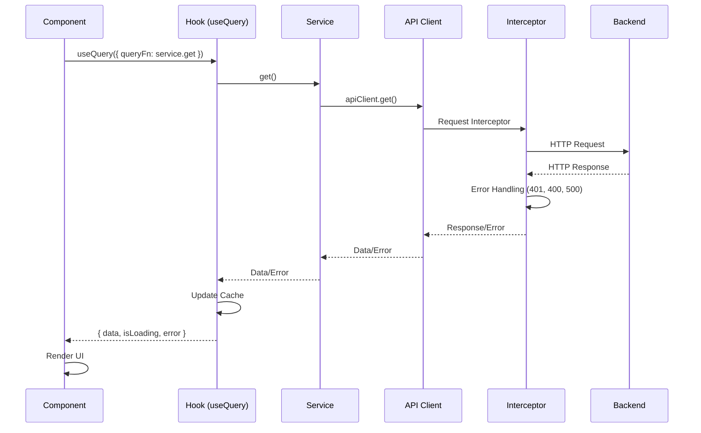

#### Arquitectura de Estado
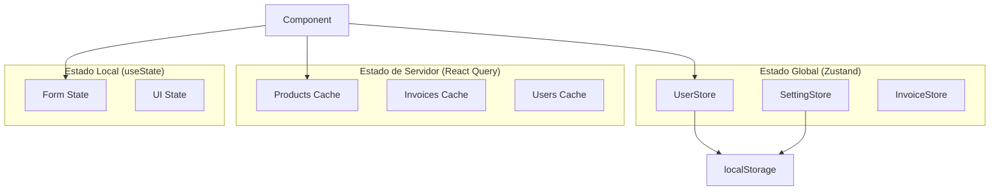

---

## Resumen Ejecutivo en 5 Puntos

1. **Arquitectura Híbrida Moderna**: El proyecto combina organización feature-based, componentes reutilizables (shadcn/ui + Ant Design) y gestión de estado con Zustand + React Query, optimizado para escalabilidad y mantenimiento.

2. **Stack Tecnológico de Vanguardia**: React 19, TypeScript, Vite, Tailwind CSS, React Query y Zustand proporcionan una base sólida para desarrollo rápido, type-safe y performante.

3. **Sistema de Temas y i18n Completo**: Implementación robusta de temas (claro/oscuro, paletas personalizables) e internacionalización (español/inglés) con persistencia de preferencias del usuario.

4. **Optimización de Performance**: Lazy loading de rutas, code splitting, caché inteligente con React Query y memoización estratégica garantizan tiempos de carga rápidos y experiencia fluida.

5. **Arquitectura Escalable y Mantenible**: Separación clara de responsabilidades (servicios API, componentes, páginas, stores), patrones consistentes y documentación técnica facilitan el onboarding y la evolución del sistema.

---

**Documentación generada el**: 2024  
**Versión del proyecto**: 0.0.0  
**Última actualización**: 2024

